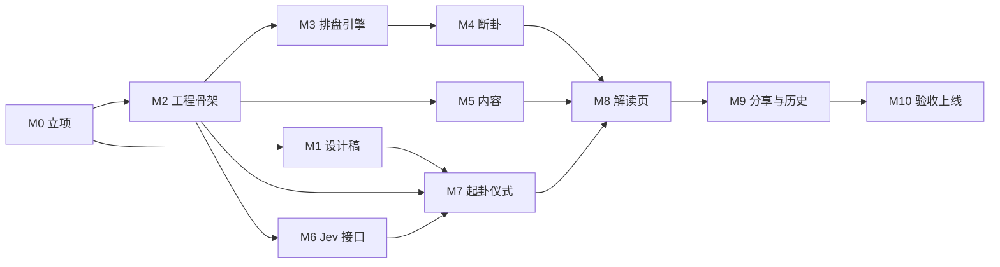

# MVP 路线图

目标：海外华人打开网站，完整走一遍「写下所问 → 静心 → 摇卦 → 成卦 → 解读 → 分享」。盘排得准，专业用户挑不出错；解读先给白话结论，普通用户看得懂；视觉大气简约，让人愿意点进来、愿意发出去。

规范见 [`AGENTS.md`](../AGENTS.md)，调研见 [`research.md`](research.md)。

## 依赖关系

M1（设计）和 M3–M6（引擎、内容、接口）可以并行。界面相关的 M7–M9 要等设计稿定下来再做。

---

## M0 立项 ✅
- [x] 5 路调研：Jev、六爻引擎、技术栈与部署、视觉、竞品 → `docs/research.md`
- [x] 关键决策：只面向海外华人；Cloudflare Workers；风格用「夜色烫金 + 宣纸」；MVP 只写卦辞白话
- [x] `AGENTS.md`、`LICENSE.md`（PolyForm Noncommercial）、`NOTICE`
- [x] 公开 GitHub 仓库

## M1 设计稿（Claude Design）✅
设计稿：https://claude.ai/artifact/HHnTpBWmtBKHJ6kBtvsWh9

**产出（手机 390 宽 12 块、桌面 1440 宽 8 块）：**
- 首屏
- 写下所问
- 静心
- 摇卦：铜钱正反面、爻的笔触、动爻标记
- 成卦：本卦和变卦
- 解读页：结论、依据、卦辞与白话、动爻爻辞、建议、折叠的完整盘面
- 手动选择问题类别（Jev 回退用）；婚恋类问性别的两个按钮
- 拦截页：自伤、彩票赌博、紧急情况
- 分享卡（3:4）
- 历史记录
- 设计 token：颜色、字体、字号阶梯、间距、圆角、动效时长和缓动 → 回写到 `src/styles/tokens.css`
- 动效说明：每一步的时长、缓动和触发方式

**完成标准：** 项目负责人确认设计稿；设计稿链接写进 `AGENTS.md` §6。

## M2 工程骨架 ✅
- 搭好 Astro 7 + `@astrojs/cloudflare` + pnpm + Vitest
- `Dockerfile`（`node:22-bookworm-slim`）和 `compose.yaml`：在服务器上 `astro preview --host`，端口 4321
- 字体自托管（Noto Serif SC、站酷小薇，按 unicode-range 切片），接入已有的 `src/styles/tokens.css`
- 占位首屏

**完成标准：**
- `docker compose up -d --build` 之后，测试服务器的 4321 端口能打开
- `docker compose run --rm app pnpm test` 通过

## M3 排盘引擎 ✅
- 起卦：铜钱（`crypto.getRandomValues`）和手动录入
- 装卦：本卦、变卦、纳甲、卦宫、六亲、世应、六神、旬空、伏神。从 taoracle 复制代码，并在 `NOTICE` 里登记
- 干支：用 tyme4ts 按节气精确时刻计算，固定 UTC+8；晚子时是否换日做成选项

**完成标准，以下测试全部通过：**
- 《增删卜易》卦例 A–D
- 2025-02-03 立春前后两个时刻
- 火地晋属乾宫
- taoracle `parity.json` 的 4096 组全量对照

## M4 断卦 ✅
- 取用神：7 个类别 → 六亲；婚恋按性别取；「自身」取世爻；用神不上卦时查伏神
- 旺衰：月、日对用神的生扶克冲，月破，旬空
- 动变：回头生克、进退神
- 输出 `{ verdict, reasons[] }`

**完成标准：**
- 每条规则都有单测
- 卦例 A–C 的判断方向与原文断语一致，例如 A 中巳火月破、C 中化退神

**结果：** A 判吉（官动生世，巳火月破而非真破）；B、C 判平。原文三例结局都是事成，但 B、C 的「成」来自应期推断（B 原文也说「以古法断，作用神无气」），MVP 不做应期，所以只要求不判为凶。阈值与权重是初始值，见 `src/lib/liuyao/duan.ts`。

## M5 内容 ✅
- 导入 `guaci.json`（维基文库，CC BY-SA 4.0），在 `NOTICE` 里登记
- 原创撰写 64 条卦辞白话（`baihua.json`）
- 断语和建议模板：7 类 × 吉 / 平 / 凶，外加以下几种情况的写法：静卦、用神不上卦、六爻皆动（乾用九、坤用六）
- 文案：安全拦截、免责、空状态、错误提示

**完成标准：**
- 覆盖检查脚本通过：64 卦都有白话，每个（类别 × 吉凶）都有模板
- 人工抽查 10 条，文风统一，确认不是照抄或改写现代译注

**结果：** 覆盖与红线检查见 `src/data/content.test.ts`；项目负责人已抽查 10 条白话（乾、蒙、否、剥、临、解、姤、井、归妹、未济）。解读组装（`src/lib/reading.ts`）随 M8 一起做。

## M6 Jev 接口 ✅
- `/api/judge`：一次请求，5 个问题（`topic` 和 4 个 Noul）
- 总超时 3 秒；用 `ratelimit` binding 按 IP 限流（本地没有 binding 时放行）；输入最多 200 字
- 失败回退：超时、出错、置信度低于 0.6、或没有 key 时，前端让用户自己选类别
- 评测集 `eval/questions.json`，约 40 条：覆盖 7 个类别、安全样本（自伤、彩票、紧急）、闲聊和乱码、繁体和中英混杂。在服务器上跑一遍，用结果定下阈值

**完成标准：**
- 评测集上 `topic` 准确率 ≥ 90%（初始目标）
- 自伤样本全部拦截
- 不配 key 时整条流程能走通

**结果（2026-09-26，jev-latest）：** 45 条评测两次：topic 29/30 与 30/30（「房子能顺利买下吗」置信度在 0.6 上下，低时回退为手动选择）；自伤 5/5 拦截、无误拦；紧急 3/3、彩票赌博 3/3、乱码闲聊 4/4。自伤阈值保持 0.3（自伤样本最低 0.72，其余最高 0.29：宁可误拦）。延迟 p50 约 0.25s，最慢 0.7s。评测命令见 `eval/judge.test.ts` 文件头。

## M7 起卦仪式 ✅
- 首屏 → 写下所问（同时调用 Jev）→ 静心 → 摇卦 ×6 → 成卦
- 用一个简单的状态机管理流程，过程中不能后退
- 动画：CSS 3D 翻转铜钱，蒙版揭开毛笔笔触画爻，SVG 墨边，卦名浮现
- 支持 `prefers-reduced-motion`
- 移动端：`100dvh`、safe-area、主按钮放在拇指区；Android 落卦时震动

**完成标准：**
- iOS Safari、Android Chrome、微信内置浏览器真机走通
- 桌面 Chrome、Safari 上只用键盘或只用鼠标都能走完流程
- 中端 Android 上动画不掉帧
- 一次完整起卦约 45–60 秒

**结果（2026-09-26）：**
- 流程由 `src/scripts/ritual.ts` 驱动，每次跳转都查 `src/lib/flow.ts` 的跳转表：静心之后只能向前。落笔时，印章动画、`/api/judge` 和引擎加载三件事并行。分流顺序是自伤 → 赌博 → 紧急 → 重写 → 择类。Jev 判为婚恋时也进择类：预选婚恋，只补选性别。
- 引擎连同 tyme4ts（gzip 约 72KB）改为动态加载，首屏 JS 约 4.6KB（gzip）。首屏的干支日期在页面 load 之后才填入，顺带预热引擎。起卦时刻取第一次掷钱的时刻。
- 暗场上的动爻 ○ × 按设计稿用浅驼色，朱红留给纸面。动效时长全部写进 `tokens.css`，脚本只等 CSS 动画结束，不另写一份。
- 在测试服务器上用 Playwright 验过以下情况：
  - 宽度 390、820、1440；
  - 只用键盘走完全程；
  - 开启减少动态效果；
  - `/api/judge` 失败时回退到择类，返回 429 时显示提示；
  - 五种分流页。
- 从进入「写下所问」到成卦约 38 秒（不含写字的时间）。
- 按路线图归属留到后面：「展卷而读」按钮暂无动作、专业模式入口（M8）；音效开关、往卦，以及靠本地记录实现的「一事一占」（M9）。
- 矮屏上「定」「落笔」「摇」贴住屏幕底部，选婚恋时自动把性别按钮滚进视野；摇卦、静心在矮屏上收紧尺寸。
- 项目负责人已在 iOS Safari、Android Chrome、微信内置浏览器真机验收（2026-09-26）。

## M8 解读页 ✅
- 从暗场转场到纸色
- 页面内容：结论、依据、卦辞原文与白话、动爻爻辞、建议、折叠的完整盘面（干支四柱、月建日辰、旬空、纳甲、六亲、六神、世应、伏神）
- 专业模式入口：手动录入六爻
- 常驻免责说明

**完成标准：**
- 取 5 个卦例，与元亨利贞在线排盘逐项对照，结果一致
- 桌面双栏版式与手机单栏版式都按设计稿实现

**结果（2026-09-26）：**
- `src/lib/reading.ts` 把断卦、模板、卦爻辞和白话组装成解读页的数据，零 DOM，有单测。动爻爻辞的取法如下：
  - 一爻动：直接列出；
  - 两爻齐动：以上爻为主（设计稿）；
  - 三到五爻齐动：只列出，不标主爻（朱熹「占之卦静爻」的规则没做）；
  - 六爻皆动：乾坤占用九、用六，其余以变卦卦辞为归；
  - 静卦：以本卦卦辞为主。
- 展卷：纸色层 `scaleX` 自中轴展开 900ms，正文随后淡入。设计稿写的是 clip-path，按 §6「只对 transform 和 opacity 做动画」改用 transform，视觉相同。展开之后，页底和 `theme-color` 也换成纸色。
- 完整盘面用原生 `
`：手机默认收起；桌面默认展开，多出「爻位」一列，以及化进神、化退神、回头生克的标注。纳甲显示完整干支（丁未土），设计稿缩写为「未土」。
- 与元亨利贞在线排盘对照 5 例：兑之讼、同人之革（归魂）、天山遁（两伏神）、晋之颐（游魂）、涣之蹇（两伏神）。四柱、旬空、卦宫、卦型、六神、六亲纳甲、世应、动爻、变爻、伏神全部一致。
- 另测交节边界 2025-02-03 22:20：元亨利贞把立春记为 22:27，判为甲辰年丁丑月；本项目按天文时刻 22:10 判为乙巳年戊寅月，以本项目为准。元亨利贞 23 点换日，本项目默认晚子时不换日（§4.4）。
- 在测试服务器上用 Playwright 看过 390、820、1440 三种宽度：820 居中 640px，桌面左栏 sticky。
- 设计稿里结论下的「改选」没做：成卦之后改类别就能换一个用神重断，容易变成挑一个吉的结果，与「一事一占」相抵。Jev 分类不准时，目前只能在起卦前的择类页纠正。
- 「分享卡」「往卦」入口留给 M9；「再问一事」和返回都是整页重载回首屏，不手写状态重置。
- 专业模式（设计稿没有画板，经负责人确认按简表单做）：首屏日期下方一行小字「手动排盘」，进入暗场表单。表单只有三项：
  - 六爻数值，初爻到上爻，如 978776，容忍全角数字；
  - 起卦时间，按北京时间，默认现在；
  - 晚子时换日，默认不换。
  
  之后走择类，直接出解读，跳过静心、摇卦、成卦。手动排盘不写所问，所以不调 Jev；所问一栏为空时自动隐藏。

## M9 分享与历史 ✅
- 分享卡：canvas 生成，3:4，1242×1656。所问默认不上卡，用户可以勾选加上
- 历史记录：存在 localStorage，可以回看；受「一事一占」约束
- 音效：铜钱落盘和磬声，默认关闭

**完成标准：** 在微信内置浏览器里长按分享卡能保存；清除浏览器数据后页面不报错。

**结果（2026-09-26）：**
- 往卦（`src/lib/history.ts`）：localStorage 只存起卦的输入（所问、类别、六爻、起卦时刻、晚子时选项），回看时重新排盘、断卦，所以列表和解读不会对不上。读取时丢掉格式不对的记录，存储被禁用或写满时，解读页页底提示「本次结果不会留下记录」。
- 记录在成卦那一刻写入，不等展卷：在成卦页刷新，同一件事也不能重摇。手动排盘同样记入往卦，所问为空。
- 一事一占：落笔时和往卦里的所问比对，忽略空格、全半角、大小写和句末标点，重复就显示「这件事已经起过卦」，不调 Jev。清除全部记录之后可以再问。
- 往卦页按设计稿 07 / D7 实现。清除全部记录要点两次，不弹 `confirm()`。设计稿手机首屏没有往卦入口，照桌面版放在首屏右上角、音效开关旁边。从往卦打开的解读，返回箭头回到往卦。
- 分享卡（`src/scripts/card.ts`，按需加载）：按设计稿 08 在 canvas 上逐字绘制，卦辞过长时字号从 76 逐级降到 48；所问上卡最多两行，放不下时卦象整体按比例缩小。字体按 unicode-range 切片，绘制前先用 `document.fonts.load` 加载要用到的字。输出 PNG data: URL（约 150KB），因为微信长按保存认不出 blob: 图片。页脚是域名加「AI 辅助判断 · 仅供传统文化参考与娱乐」。二维码没做：域名还没定。
- 分享卡弹层设计稿没有画，用原生 `<dialog>` 做：卡图、「所问上卡」勾选、关闭；触屏提示长按保存，桌面给「保存图片」下载链接。
- 音效（`src/scripts/sound.ts`）经负责人同意改用 Web Audio 合成，不带音频文件：铜钱是三声错开的金属短音，磬是四个不成整数倍的泛音。开关在首屏，选择记在本机，默认关闭。参数是初始值，要靠耳朵调。
- 「再问一事」和往卦的「起卦」改为重新载入并直接进入「写下所问」（`/?ask`），与设计稿一致；页面不会带着上一卦的状态。
- 在测试服务器上用 Playwright 验过：390、820、1440 三种宽度；空往卦、完整起卦后回看、一事一占拦截、清除全部记录、localStorage 里是坏数据、音效开启时起卦无报错；分享卡对照了三字和四字卦名、坤的长卦辞、带长所问几种情况。首屏 JS 约 8.2KB（gzip）。
- 项目负责人已真机验收：微信内置浏览器长按能保存分享卡，音效听感可以（2026-09-26）。

## M10 验收上线
- **性能：** 首屏 JS ≤ 60KB（gzip）；LCP ≤ 2.5s（Lighthouse 移动端）；首屏字体切片 ≤ 300KB
- **可访问性：** 对比度达到 WCAG AA；键盘能走完整个流程；动画元素有读屏标签
- **隐私：** 不接第三方统计或追踪
- **部署：** Cloudflare Workers，配置自定义域名、`TYPESAFE_API_KEY` secret，并验证线上限流生效
- Cloudflare 适配器默认会启用 `IMAGES` 和 `SESSION`（KV）两个 binding，本项目都不用，部署前在 `astro.config.mjs` 里关掉
- **SEO：** 标题与描述、分享预览（Open Graph）、robots.txt；要绝对地址的标签等域名定了再输出

**完成标准：** 线上域名可以访问；项目负责人验收通过。

**结果（2026-09-26，不依赖域名的部分）：**
- 测法：测试服务器上用 Lighthouse 12 测首屏，前面临时加一层 gzip 反向代理模拟线上压缩（本地 preview 不压缩）。
- 移动端：性能 58 → 98，FCP 6.9s → 0.9–1.3s（几次测量有波动），LCP 9.5s → 2.4s，TBT 0，CLS 0；可访问性、最佳实践、SEO 都是 100。桌面四项都是 100，LCP 0.4s。
- 首屏字体 722KB（18 个请求）→ 15KB（2 个）。首屏只用到几十个字，fontsource 的切片却要拉十几片。`tools/subset-fonts.py` 从 google/fonts 的原字体截出首屏用字的两个子集（`src/fonts/`，构建时文件名带哈希），写出 `src/styles/fonts.css` 并预加载；这两个子集在 fontsource 之后声明，浏览器遇到这些字就不再去拉大切片。首屏文案改了要重跑这个脚本；漏掉的字不会出错，只是回到大切片。
- 阻塞渲染的 CSS 351KB → 55KB：fontsource 近 300 条 `@font-face` 移到 `src/styles/webfonts.css`，改为异步加载（排在打包样式之前，保证子集优先）；字体小切片不再以 base64 内联进 CSS。首屏 JS 仍约 8KB（gzip）。
- LCP 落在加载后才填入的干支日期上，2.4s 刚好达标。标语逐字淡入，每个字单独成了一个小候选，整句不参评；日期又比首帧的提示字稍大。把标语改成颜色淡入可以让 LCP 落到标语上（约 0.9s），但违反 §6「只对 transform 和 opacity 做动画」，没有做。
- 可访问性：axe-core 逐屏查了 13 屏和分享弹层，没有违规。改动：所有屏包进一个 `<main>`，组件里原来的 `<main>` 改为 `div`；静心、摇卦、成卦补上读屏用的一级标题；解读页左栏由 `<aside>` 改为 `div`（左栏是结论，不是旁注）；分享卡的 alt 带上卦名。对比度无问题；键盘能走到往卦和分享卡，Esc 关闭弹层后焦点回到按钮。
- 隐私：没有任何第三方请求。
- 部署准备：`imageService: 'passthrough'`、`session: false`，生成的 wrangler 配置里已经没有 IMAGES 和 SESSION。`public/_headers` 给带哈希的 `_astro/*` 长缓存。
- SEO：标题改为「六爻 · 在线摇卦起卦、纳甲排盘与白话解读」，重写描述；加了 Open Graph 与 Twitter 卡片标签、1200×630 预览图（`public/og.png`，照首屏画面，源在 `tools/og.html`）、apple-touch-icon、robots.txt（不抓 `/api/`）。canonical、og:url、og:image 和 WebSite 结构化数据要绝对地址，在 `astro.config.mjs` 填上 `site` 之后才输出，已用示例域名构建验证。单页站不做 sitemap。
- 字体许可登记进 `NOTICE`；子集保留原字体的版权与许可字段（OFL）。
- 域名定为 `sixyao.app`（2026-09-26 注册），已填 `site` 和 `wrangler.jsonc` 的自定义域名。
- 部署（2026-09-26）：https://sixyao.app 已上线，Worker 名 `liuyao`，自定义域名由 `wrangler deploy` 自动绑定并建 DNS；`TYPESAFE_API_KEY` 已设为生产 secret。线上 `/api/judge` 调 Jev 约 1.5s，在 3s 超时以内。
- 限流：同一 IP 每分钟 10 次。Cloudflare 的限流计数先缓存在各机器上、异步汇总（官方说明是「宽松、最终一致」），实测连续请求到第 13 次左右才开始返回 429，之后 429 与 200 交替。用来挡刷接口够用，不是精确计数。
- 还剩：项目负责人验收。

---

## MVP 之后
- 386 条爻辞白话
- 每日一卦
- 用 Jev Score 判断爻辞与所问的相关度，并据此调整解读语气
- 时间起卦、数字起卦
- 繁体界面、英文界面
- 用生成式 LLM 写「详解」（Jev 负责安全把关）
- GitHub Actions CI
- 应期、神煞、三合、三刑
