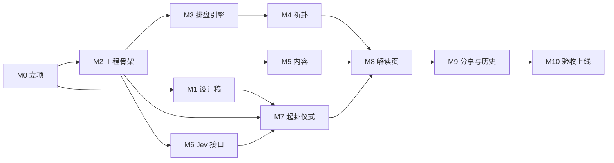

# MVP 路线图

目标：海外华人打开网站，完整走一遍「写下所问 → 静心 → 摇卦 → 成卦 → 解读 → 分享」。盘排得准，专业用户挑不出错；解读先给白话结论，普通用户看得懂；视觉大气简约，让人愿意点进来、愿意发出去。

规范见 [`AGENTS.md`](../AGENTS.md)，调研见 [`research.md`](research.md)。

## 依赖关系

M1（设计）和 M3–M6（引擎、内容、接口）可以并行。界面相关的 M7–M9 要等设计稿定下来再做。

---

## M0 立项 ✅
- [x] 5 路调研：Jev、六爻引擎、技术栈与部署、视觉、竞品 → `docs/research.md`
- [x] 关键决策：只面向海外华人；Cloudflare Workers；风格用「夜色烫金 + 宣纸」；MVP 只写卦辞白话
- [x] `AGENTS.md`、`LICENSE.md`（PolyForm Noncommercial）、`NOTICE`
- [x] 公开 GitHub 仓库

## M1 设计稿（Claude Design）✅
设计稿：https://claude.ai/artifact/HHnTpBWmtBKHJ6kBtvsWh9

**产出（手机 390 宽为主，桌面 1440 宽做适配）：**
- 首屏
- 写下所问
- 静心
- 摇卦：铜钱正反面、爻的笔触、动爻标记
- 成卦：本卦和变卦
- 解读页：结论、依据、卦辞与白话、动爻爻辞、建议、折叠的完整盘面
- 手动选择问题类别（Jev 回退用）；婚恋类问性别的两个按钮
- 拦截页：自伤、彩票赌博、紧急情况
- 分享卡（3:4）
- 历史记录
- 设计 token：颜色、字体、字号阶梯、间距、圆角、动效时长和缓动 → 回写到 `src/styles/tokens.css`
- 动效说明：每一步的时长、缓动和触发方式

**完成标准：** 项目负责人确认设计稿；设计稿链接写进 `AGENTS.md` §6。

## M2 工程骨架 ✅
- 搭好 Astro 7 + `@astrojs/cloudflare` + pnpm + Vitest
- `Dockerfile`（`node:22-bookworm-slim`）和 `compose.yaml`：在服务器上 `astro preview --host`，端口 4321
- 字体自托管（Noto Serif SC、站酷小薇，按 unicode-range 切片），接入已有的 `src/styles/tokens.css`
- 占位首屏

**完成标准：**
- `docker compose up -d --build` 之后，测试服务器的 4321 端口能打开
- `docker compose run --rm app pnpm test` 通过

## M3 排盘引擎
- 起卦：铜钱（`crypto.getRandomValues`）和手动录入
- 装卦：本卦、变卦、纳甲、卦宫、六亲、世应、六神、旬空、伏神。从 taoracle 复制代码，并在 `NOTICE` 里登记
- 干支：用 tyme4ts 按节气精确时刻计算，固定 UTC+8；晚子时是否换日做成选项

**完成标准，以下测试全部通过：**
- 《增删卜易》卦例 A–D
- 2025-02-03 立春前后两个时刻
- 火地晋属乾宫
- taoracle `parity.json` 的 4096 组全量对照

## M4 断卦
- 取用神：7 个类别 → 六亲；婚恋按性别取；「自身」取世爻；用神不上卦时查伏神
- 旺衰：月、日对用神的生扶克冲，月破，旬空
- 动变：回头生克、进退神
- 输出 `{ verdict, reasons[] }`

**完成标准：**
- 每条规则都有单测
- 卦例 A–C 的判断方向与原文断语一致，例如 A 中巳火月破、C 中化退神

## M5 内容
- 导入 `guaci.json`（维基文库，CC BY-SA 4.0），在 `NOTICE` 里登记
- 原创撰写 64 条卦辞白话（`baihua.json`）
- 断语和建议模板：7 类 × 吉 / 平 / 凶，外加以下几种情况的写法：静卦、用神不上卦、六爻皆动（乾用九、坤用六）
- 文案：安全拦截、免责、空状态、错误提示

**完成标准：**
- 覆盖检查脚本通过：64 卦都有白话，每个（类别 × 吉凶）都有模板
- 人工抽查 10 条，文风统一，确认不是照抄或改写现代译注

## M6 Jev 接口
- `/api/judge`：一次请求，5 个问题（`topic` 和 4 个 Noul）
- 总超时 3 秒；用 `ratelimit` binding 按 IP 限流（本地没有 binding 时放行）；输入最多 200 字
- 失败回退：超时、出错、置信度低于 0.6、或没有 key 时，前端让用户自己选类别
- 评测集 `eval/questions.json`，约 40 条：覆盖 7 个类别、安全样本（自伤、彩票、紧急）、闲聊和乱码、繁体和中英混杂。在服务器上跑一遍，用结果定下阈值

**完成标准：**
- 评测集上 `topic` 准确率 ≥ 90%（初始目标）
- 自伤样本全部拦截
- 不配 key 时整条流程能走通

## M7 起卦仪式
- 首屏 → 写下所问（同时调用 Jev）→ 静心 → 摇卦 ×6 → 成卦
- 用一个简单的状态机管理流程，过程中不能后退
- 动画：CSS 3D 翻转铜钱，蒙版揭开毛笔笔触画爻，SVG 墨边，卦名浮现
- 支持 `prefers-reduced-motion`
- 移动端：`100dvh`、safe-area、主按钮放在拇指区；Android 落卦时震动

**完成标准：**
- iOS Safari、Android Chrome、微信内置浏览器真机走通
- 中端 Android 上动画不掉帧
- 一次完整起卦约 45–60 秒

## M8 解读页
- 从暗场转场到纸色
- 页面内容：结论、依据、卦辞原文与白话、动爻爻辞、建议、折叠的完整盘面（干支四柱、月建日辰、旬空、纳甲、六亲、六神、世应、伏神）
- 专业模式入口：手动录入六爻
- 常驻免责说明

**完成标准：** 取 5 个卦例，与元亨利贞在线排盘逐项对照，结果一致。

## M9 分享与历史
- 分享卡：canvas 生成，3:4，1242×1656。所问默认不上卡，用户可以勾选加上
- 历史记录：存在 localStorage，可以回看；受「一事一占」约束
- 音效：铜钱落盘和磬声，默认关闭

**完成标准：** 在微信内置浏览器里长按分享卡能保存；清除浏览器数据后页面不报错。

## M10 验收上线
- **性能：** 首屏 JS ≤ 60KB（gzip）；LCP ≤ 2.5s（Lighthouse 移动端）；首屏字体切片 ≤ 300KB
- **可访问性：** 对比度达到 WCAG AA；键盘能走完整个流程；动画元素有读屏标签
- **隐私：** 不接第三方统计或追踪
- **部署：** Cloudflare Workers，配置自定义域名、`TYPESAFE_API_KEY` secret，并验证线上限流生效
- Cloudflare 适配器默认会启用 `IMAGES` 和 `SESSION`（KV）两个 binding，本项目都不用，部署前在 `astro.config.mjs` 里关掉

**完成标准：** 线上域名可以访问；项目负责人验收通过。

---

## MVP 之后
- 386 条爻辞白话
- 每日一卦
- 用 Jev Score 判断爻辞与所问的相关度，并据此调整解读语气
- 时间起卦、数字起卦
- 繁体界面、英文界面
- 用生成式 LLM 写「详解」（Jev 负责安全把关）
- GitHub Actions CI
- 应期、神煞、三合、三刑
